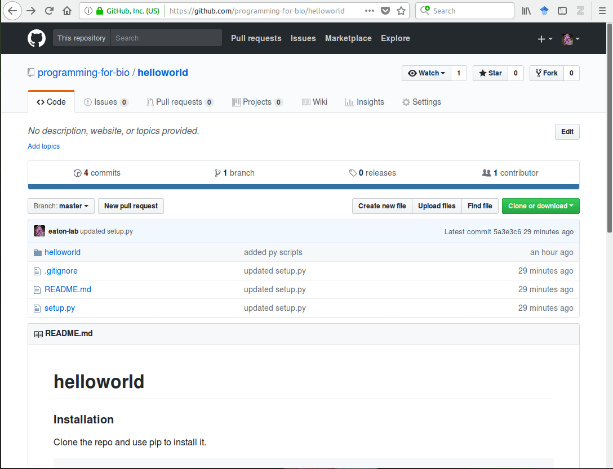

## Code Review Instructions

1. Find who you are supposed to review on the [code-review-map.md](https://github.com/programming-for-bio/5-Packaging/blob/master/code-review-map.md). 

2. Follow the instructions on their README to test their code. This 
   should involve cloning their repo (you'll need to clone it somewhere
   different from where yours is located since they have the same directory
   name) and then doing a `pip install .` command. 

3. Use -h to test their executable. Read the help message and test out each 
   of the commands that they created in their `helloworld` executable. 

4. Open their package in sublime using `subl .` in their directory. Take 
   a look at their files. Check or any errors in their files, maybe your 
   linter will highlight it for you if they have some. 

5. Go to their GitHub helloworld repo page and open an Issue ticket. In the 
   Issue report the following: 1. Were you able to successfully clone and 
   install their package? 2. Were you able to run their executable helloworld program? 3. Did you their package code look clean and properly
   formatted so there were few or no linter errors? Click to submit your 
   issue when you are done. The gif below demonstrates opening an Issue. 

